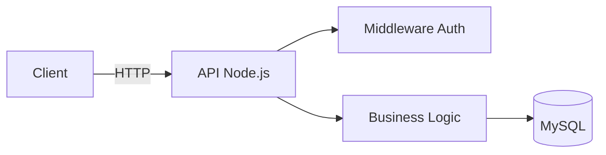

# 👋 Olá! Eu sou o Hitalo Faria Almeida

> Estudante de Ciência da Computação na FUMEC • Estagiando como Full Stack na WBM Technology • Apaixonado por construir APIs e interfaces.

[🇧🇷 PT-BR](#) | [🇺🇸 EN (soon)]

---

## 🔍 Sobre mim

- 🎯 Foco atual: fortalecer base em arquitetura de APIs, boas práticas de TypeScript e React.
- 🧠 Mentalidade: aprender construindo – prefiro validar com projetos reais.
- 🤝 Aberto a: colaboração em projetos open source, revisões de código e estudos em grupo.
- 🚀 Objetivo de médio prazo: evoluir para Desenvolvedor Full Stack júnior com domínio em backend

---

## 🛠️ Tecnologias

| Categoria        | Tecnologias |
|------------------|-------------|
| Front-end        | HTML5, CSS3, JavaScript (ES6+), React |
| Back-end         | Node.js, TypeScript, (Express) |
| Banco de Dados   | MySQL, PHP |
| Ferramentas      | Git, GitHub, (Docker - em estudo), Postman, VS Code |
| Estudando Agora  | Testes (Jest), Otimização de queries, Padrões arquiteturais |

  
  
  
  
  
  
  
  

---

## 📊 Estatísticas

  
  

  

---

## ⭐ Projetos em Destaque

| Projeto | Descrição | Tecnologias | Código |
|---------|-----------|-------------|--------|
| API | Fazer monitoramento de disversos dipositivos IoT | Node.js, TS, MySQL | [Repositório](https://github.com/MrHitalo/Api) |
| Gaveta | Faz leitura de dados coletados por esp32 via wifi | Node.js, JS, TS, React | [Repositório](https://github.com/MrHitalo/Gaveta) |
| Comunicação Alimentadores | Comunicação com sensores de alimetador para leitura e recebimento de comandos | Node.js, JS | [Repositório](https://github.com/WbmProjetoAlimentador/ComunicacaoAlimentadores) |

---

## 🧪 Próximos Passos (Roadmap Pessoal)

- [ ] Implementar testes unitários e de integração em projeto de API.
- [ ] Estudar Docker e compose para ambiente dev isolado.
- [ ] Criar um pequeno dashboard em React consumindo minha própria API.
- [ ] Adotar ESLint + Prettier padronizados em todos os repositórios.

---

## 📚 Aprendizados Recentes

- (Semana 1) Refatoração de endpoints para separar camadas (controller/service/repository).
- (Semana 2) Estudo sobre índices no MySQL para otimizar consultas.
- (Semana 3) Introdução a testes com Jest em ambiente Node.

---

## 🧩 Mini Diagrama (exemplo API)

---

## 🤝 Como colaborar

1. Faça um fork para contribuir e implementar também as suas ideias.

---

## 📬 Contato

  
  

---

## 🙋 Sobre este README

Sempre em evolução. Sugestões? Abra uma issue aqui mesmo!  
Feito por [Hitalo Faria Almeida](https://github.com/MrHitalo) ✨
