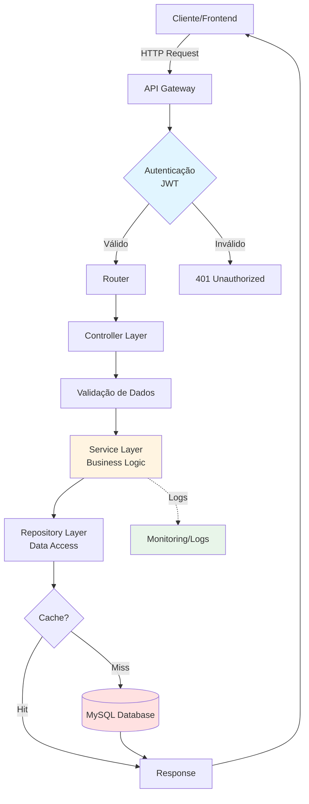

<div align="center">

# 👋 Hitalo Faria Almeida

### Desenvolvedor Full Stack | Especialista em APIs & Sistemas de Monitoramento

[](https://www.linkedin.com/in/hitalofariaalmeida/)
[](https://github.com/MrHitalo)
[](https://github.com/MrHitalo)

**Ciência da Computação @ FUMEC** • **Full Stack @ WBM Technology**

*Transformando dados em soluções escaláveis através de APIs robustas e interfaces intuitivas*

[🇧🇷 PT-BR](#) | [🇺🇸 EN (soon)]

</div>

---

## 🎯 Sobre mim

```typescript
const hitalo = {
  codigo: "Resolver problemas complexos com código limpo",
  foco: ["Arquitetura de APIs", "Sistemas de Monitoramento", "Otimização de Performance"],
  mentalidade: "Aprender fazendo → validar com projetos reais",
  diferencial: "Combino backend robusto com experiência em IoT e dados em tempo real",
  buscando: "Oportunidades para criar impacto com tecnologia escalável"
};
```

**O que me move:**
- 💡 Desenvolver soluções que otimizam processos e geram valor mensurável
- 🔄 Aprendizado contínuo através de projetos desafiadores e reais
- 🤝 Colaboração em equipe e compartilhamento de conhecimento
- 📊 Transformar dados brutos em insights acionáveis

---

## 🛠️ Tecnologias

| Categoria        | Tecnologias |
|------------------|-------------|
| Front-end        | HTML5, CSS3, JavaScript (ES6+), React |
| Back-end         | Node.js, TypeScript, (Express) |
| Banco de Dados   | MySQL, PHP |
| Ferramentas      | Git, GitHub, (Docker - em estudo), Postman, VS Code |
| Estudando Agora  | Testes (Jest), Otimização de queries, Padrões arquiteturais |

<p align="center">
  
  
  
  
  
  
  
  
</p>

---

## 📊 Estatísticas

<p align="center">
  
  
</p>

<p align="center">
  
</p>

---

## 💼 Soluções & Experiência

<table>
<tr>
<td width="50%">

### 🔄 Sistemas de Monitoramento
Desenvolvimento de plataformas para **acompanhamento em tempo real** de dispositivos e ativos, com dashboards intuitivos e alertas automatizados.

**Aplicações:**
- Gestão de recursos distribuídos
- Telemetria e análise de dados IoT
- Rastreamento de performance

</td>
<td width="50%">

### 🚀 APIs Escaláveis
Arquitetura de **APIs RESTful robustas** para integração de sistemas, com foco em performance e segurança.

**Características:**
- Autenticação e autorização
- Documentação automatizada
- Otimização de consultas
- Arquitetura em camadas

</td>
</tr>
<tr>
<td width="50%">

### 📊 Analytics & Dashboards
Transformação de dados em **visualizações acionáveis**, facilitando tomada de decisão baseada em métricas.

**Capacidades:**
- Processamento de dados em tempo real
- Geração de relatórios automatizados
- Integração com múltiplas fontes

</td>
<td width="50%">

### 🔧 Otimização de Processos
Automação e **melhoria de workflows** através de soluções tecnológicas que aumentam eficiência operacional.

**Foco:**
- Redução de redundâncias
- Performance de queries
- Escalabilidade de sistemas

</td>
</tr>
</table>

---

## ⭐ Projetos em Destaque

### 🔌 [API de Monitoramento IoT](https://github.com/MrHitalo/Api)
**Sistema centralizado para gerenciamento de múltiplos dispositivos IoT**

- 🎯 **Desafio:** Monitorar diversos dispositivos distribuídos em tempo real com baixa latência
- ⚡ **Solução:** API RESTful com arquitetura em camadas, autenticação JWT e otimização de queries
- 🛠️ **Stack:** Node.js, TypeScript, MySQL, Express
- 📈 **Resultado:** Centralização de dados de múltiplos sensores com consultas otimizadas

**Destaques técnicos:**
- Middleware de autenticação personalizado
- Estrutura escalável (controller → service → repository)
- Tratamento robusto de erros e validações

---

### 📡 [Gaveta - Dashboard IoT](https://github.com/MrHitalo/Gaveta)
**Aplicação full stack para coleta e visualização de dados de ESP32**

- 🎯 **Desafio:** Interface intuitiva para dados em tempo real de dispositivos ESP32 via WiFi
- ⚡ **Solução:** Frontend React integrado com backend Node.js para processamento de telemetria
- 🛠️ **Stack:** Node.js, TypeScript, React, JavaScript
- 📈 **Resultado:** Dashboard responsivo com atualização em tempo real

**Destaques técnicos:**
- Comunicação WiFi otimizada com ESP32
- Componentes React reutilizáveis
- Integração backend-frontend eficiente

---

### 🔄 [Sistema de Comunicação com Sensores](https://github.com/WbmProjetoAlimentador/ComunicacaoAlimentadores)
**Plataforma de comunicação bidirecional com sensores industriais**

- 🎯 **Desafio:** Estabelecer comunicação confiável para leitura e envio de comandos
- ⚡ **Solução:** Sistema de comunicação assíncrona com retry automático e logs detalhados
- 🛠️ **Stack:** Node.js, JavaScript
- 📈 **Resultado:** Comunicação estável e rastreável com dispositivos de campo

**Destaques técnicos:**
- Protocolo de comunicação robusto
- Sistema de retry para garantir entrega
- Logging estruturado para debugging

---

## 🎖️ Diferenciais & Competências

<div align="center">

| 🔧 Técnicas | 🧠 Metodológicas | 🤝 Interpessoais |
|-------------|------------------|-------------------|
| Clean Code & SOLID | Resolução de Problemas | Trabalho em Equipe |
| API Design & REST | Debugging Sistemático | Comunicação Clara |
| Arquitetura em Camadas | Documentação | Proatividade |
| Otimização de Performance | Versionamento Git | Aprendizado Rápido |
| Segurança (JWT, Auth) | Testes & Qualidade | Adaptabilidade |

</div>

### 💡 Pontos Fortes

```diff
+ Experiência prática com IoT e sistemas de monitoramento em tempo real
+ Capacidade de transformar requisitos de negócio em soluções técnicas
+ Foco em código limpo, escalável e bem documentado
+ Pensamento analítico para otimização de queries e performance
+ Mentalidade de crescimento contínuo e disposição para desafios
```

---

## 🧪 Próximos Passos (Roadmap de Crescimento)

**Qualidade & Testes**
- [ ] Implementar testes unitários e de integração com Jest em API de produção
- [ ] Configurar CI/CD básico com GitHub Actions

**Infraestrutura & DevOps**
- [ ] Dominar Docker e Docker Compose para ambientes isolados
- [ ] Estudar conceitos de observabilidade (logs, métricas, traces)

**Performance & Escalabilidade**
- [ ] Otimizar queries complexas com índices e explain analyze
- [ ] Implementar cache estratégico (Redis) em endpoints críticos

---

## 📚 Em Aprendizado Contínuo

<table>
<tr>
<td width="33%">
<h4>🏗️ Arquitetura</h4>

- Design Patterns aplicados
- Microserviços e APIs
- Event-driven architecture
- Separação de camadas

</td>
<td width="33%">
<h4>⚡ Performance</h4>

- Otimização de queries SQL
- Índices e estratégias
- Profiling de aplicações
- Caching inteligente

</td>
<td width="33%">
<h4>🧪 Qualidade</h4>

- TDD com Jest
- Testes de integração
- Code review practices
- Documentação técnica

</td>
</tr>
</table>

---

## 🧩 Arquitetura de Exemplo



> **Arquitetura em camadas** aplicada em projetos reais, garantindo separação de responsabilidades, testabilidade e escalabilidade.

---

## 🤝 Colaboração & Open Source

Acredito no poder da **colaboração** para acelerar o aprendizado. Se você tem um projeto interessante ou quer trocar conhecimento:

- 🔄 Faça um fork dos meus projetos e contribua com ideias
- 💬 Abra issues com sugestões ou dúvidas técnicas
- 🤝 Vamos construir algo juntos!

---

## 📬 Vamos Conversar?

<div align="center">

### 🚀 Interessado em um desenvolvedor proativo, focado em resultados e apaixonado por tecnologia?

**Estou aberto a oportunidades que me desafiem a crescer e gerar impacto real!**

<br>

<a href="https://www.linkedin.com/in/hitalofariaalmeida/" target="_blank">
  
</a>
<a href="mailto:hitalofariaalmeida1602@gmail.com">
  
</a>

<br><br>

📍 **Belo Horizonte, MG** | 💼 **Disponível para novos desafios** | 🌱 **Em constante evolução**

</div>

---

<div align="center">

### ⭐ Se este perfil te inspirou, deixe uma estrela nos repositórios!

*Feito com 💙 por [Hitalo Faria Almeida](https://github.com/MrHitalo)*

**"Código é poesia em sintaxe"** ✨

</div>
